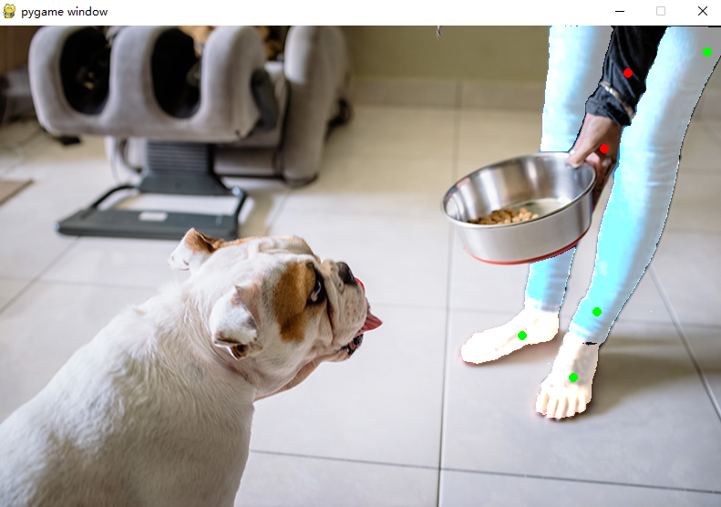

## 我们想实现SAM对简单物体进行建模
-------------------------------------------

#首先我们做了一个GUI
我们的gui是GUI.py这个文件，剩下的ipynb文件是SAM中的文件，我们将基于SAM完成我们的程序。
### 本次更行于23/4/25
-------------------------------------------
### 将SAM与pygame结合实现可交互图像分割

### 本次更行于23/4/27

--------------------------------------------

##追加需求

1.需要固定图片的大小，从而实现固定gui的布局

2.需要将文本输入，需要将文本传入DINO中实现检测。

## 演示视频

https://user-images.githubusercontent.com/52237355/236663990-f779465a-5deb-426e-b1cd-c4abe0b6b2e3.mp4

--------------------------------------------

## 自动标注

运行DINO+SAM+GUI.py文件对单张图片实现自动标注

https://github.com/v5a/SAM_for_3D/assets/52237355/6ed60f2d-958e-4c08-aa3c-03ab1dcf034d

# 自动标注

支持多种图片格式，利用grounding DINO实现自动标注。

https://github.com/v5a/SAM_for_3D/assets/52237355/4ca64c3f-5fa4-4222-a422-ef06432bc074
